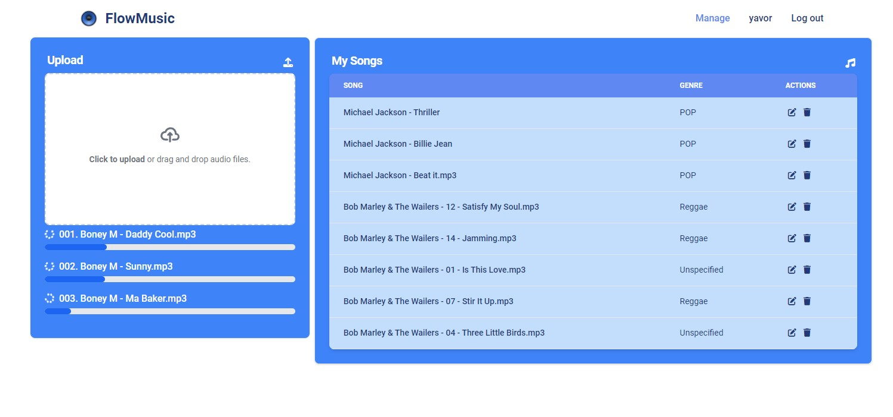
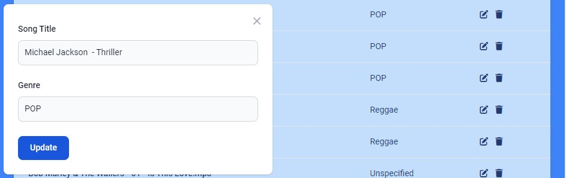
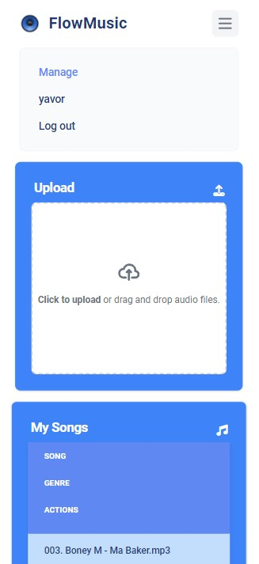

# FlowMusic

FlowMusic is a music player app built with [Vue.js](https://vuejs.org/).

## Installation and running the project

#### Installing the dependencies

```js
npm i
```

#### Running the project

```js
npm run dev
```

#### Running the tests

```js
npm run cypress
```

## Technologies Used

[VueJS](https://vuejs.org/) - the progressive JavaScript framework

[Vue Router](https://router.vuejs.org/) - the official router for VueJS

[Vuelidate](https://vuelidate-next.netlify.app/) - a lightweight model-based validation for Vue.js

[Pinia](https://pinia.vuejs.org/) - the official store library for VueJS

[Tailwind CSS](https://tailwindcss.com/) - a utility-first CSS framework

[Flowbite](https://flowbite.com/) - a set of design tokens and components based on the popular Tailwind CSS framework.

[Firebase](https://firebase.google.com/) - an app development and hosting platform

[Cypress](https://docs.cypress.io/) - an E2E testing framework for applications

[Howler](https://howlerjs.com/) - an audio library for the modern web.


## Features

#Authentication

The authentication is provided by [Firebase](https://firebase.google.com/). Users can create accounts, register, log in and log out.

Every user can only see and play his/her own songs.

The Sign in and Registration forms are validated with [Vuelidate](https://vuelidate-next.netlify.app/). All fields show the appropriate errors when the user input doesn't meet the fields' validation criteria. The Register and Login buttons only become active when all fields have been validated.


### Playing a song and posting comments

Clicking on any of the songs from the home page opens the page for that particular song where the user can listen to it and post comments. The comments can be filtered from latest to oldest. The progress bar at the bottom of the page also serves as time control. By pressing on it, the user can skip through certain sections of the song. The song can be paused and resumed. Going back to the home page shows the currently played song in bright blue as illustrated on the first screenshot.


### Uploading songs

Logged in users can upload songs into the My Songs section of the Manage page either by drag and dropping several audio files from their disk or manually doing so. Successfully uploaded files are listed under the My Songs section, and can be played through the home page. The upload progress of each song is listed under the Upload section:



### Updating song name and genre, and deleteting songs

Each song's name and genre can be updated or the song itself deleted through the Actions column of the MySongs table:



### Responsiveness

The app's design is also responsive and can be used on mobile devices:



## Unit tests

E2E tests are present in the "cypress" folder and can be run in the browser with "npm run cypress".

---

The live app is hosted at [Firebase](https://flowmusic-20cf4.web.app/).
